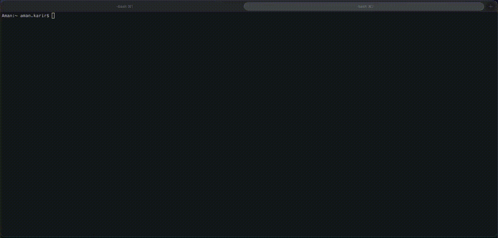

# eks-upgrade-check

Pre checks for EKS upgrades — identify blockers, predict node drain failures, and generate actionable fixes before you upgrade.


A single CLI that combines **AWS EKS Upgrade Insights**, **AWS CLI checks**, and **kubectl cluster inspection** into one unified pre-flight report for EKS Kubernetes upgrades.

Right now, preparing for an EKS upgrade means checking three different places: the EKS Insights console for deprecated API usage, the AWS CLI for add-on versions and node group status, and kubectl for PDBs, IRSA, and workload health. This tool pulls all of it together so you get the full picture in your terminal before you touch anything.

Built from real world upgrade pain migrating EKS clusters from 1.29 → 1.32 in production environments.

## Example

> Running a full EKS upgrade readiness check with drain impact analysis



## Key features

- Single CLI for full EKS upgrade readiness (AWS + Kubernetes + Helm)
- Uses AWS EKS Insights + live cluster inspection
- Detects real-world blockers (PDBs, IRSA gaps, outdated Helm charts)
- Predicts node drain failures before they happen
- Provides exact commands to fix issues
- Dynamic upgrade plan built from your cluster's actual state
- Supports interactive and CLI-driven workflows
- Outputs JSON and Markdown for automation

## Who this is for

- Platform / DevOps engineers running EKS clusters
- Teams planning Kubernetes version upgrades
- Engineers who want to avoid upgrade downtime and surprises

## Quick start

### macOS

```bash
git clone https://github.com/AmanSK5/eks-upgrade-check.git
cd eks-upgrade-check
python3 -m venv venv
source venv/bin/activate
pip install .
eks-upgrade-check
```

> **Note:** macOS restricts installs to the system Python. The virtual environment avoids this. If you use [pyenv](https://github.com/pyenv/pyenv) or [Homebrew Python](https://formulae.brew.sh/formula/python@3.12), you can skip the venv and run `pip install .` directly.

### Linux

```bash
git clone https://github.com/AmanSK5/eks-upgrade-check.git
cd eks-upgrade-check
python3 -m venv venv
source venv/bin/activate
pip install .
eks-upgrade-check
```

### Windows

```powershell
git clone https://github.com/AmanSK5/eks-upgrade-check.git
cd eks-upgrade-check
python -m venv venv
.\venv\Scripts\Activate.ps1
pip install .
eks-upgrade-check
```

### Using pipx (any OS)

If you have [pipx](https://pipx.pypa.io/) installed, it handles the virtual environment for you:

```bash
pipx install git+https://github.com/AmanSK5/eks-upgrade-check.git
eks-upgrade-check
```

### After installation

Once installed, run the tool from anywhere:

```bash
# Interactive mode — guided setup, no flags needed
eks-upgrade-check

# Or direct
eks-upgrade-check --cluster my-prod-eks --target 1.31 -p MyAWSProfile -r eu-west-2
```

> **Tip:** If using a virtual environment, you'll need to activate it (`source venv/bin/activate` or `.\venv\Scripts\Activate.ps1`) each time you open a new terminal before running `eks-upgrade-check`.

## Prerequisites

- **Python 3.9+**
- **AWS CLI** configured with a profile that can access your EKS account (`~/.aws/config` and `~/.aws/credentials`). The tool uses your existing AWS config — it does not modify it.
- **kubectl** configured with your kubeconfig pointing at the target EKS cluster (`~/.kube/config`). If you haven't set this up yet, run `aws eks update-kubeconfig --name <cluster> --region <region>` before using this tool.
- **helm** (optional) — needed for the Helm chart staleness checks. If not installed, the tool skips that check gracefully.

## Safety

- **Read-only** — no changes are made to your cluster or AWS account
- Uses only `describe`, `list`, and `get` operations
- No credentials are stored or modified
- Drain impact analysis uses programmatic logic, not `kubectl drain`

## Checks performed

| Check | Source | What it does |
|-------|--------|-------------|
| **Control Plane** | AWS API | Validates upgrade path, detects multi-hop requirements, checks extended support dates |
| **EKS Insights** | AWS API | Pulls AWS's built-in upgrade readiness insights — deprecated API usage from audit logs, add-on compatibility, kube-proxy version skew |
| **Deprecated APIs** | kubectl | Scans live running workloads for API versions removed in the target (or upcoming) K8s release |
| **Add-ons** | AWS API + kubectl | Identifies self-managed vs EKS-managed add-ons, flags version lag, checks target version compatibility |
| **IRSA** | kubectl + AWS API | Validates IAM Roles for Service Accounts on critical controllers (LB controller, EBS CSI, etc.) |
| **Nodes** | AWS API + kubectl | Flags AL2 AMIs (EOL), mixed kubelet versions, NotReady nodes, scaling headroom issues |
| **PDBs** | kubectl | Finds PodDisruptionBudgets that will block node drains (e.g. `maxUnavailable: 0`) |
| **Helm** | helm CLI | Detects outdated chart versions, failed releases, and deprecated charts |
| **Drain Impact Analysis** | kubectl | Predicts per-node drain outcome — PDB blocks, single-replica downtime, standalone pods, emptyDir data loss |

### Why not just use EKS Insights?

EKS Insights is great but it only covers part of the picture. It scans audit logs for deprecated API calls and checks add-on compatibility, but it won't tell you:

- That your Load Balancer Controller is missing IRSA and will silently fail to register new nodes into target groups
- That your Consul PDB has `maxUnavailable: 0` and will block every node drain
- That your node groups are still running Amazon Linux 2 which is past EOL
- That your Helm charts are several major versions behind and may break on the target K8s version
- That half your nodes can't be drained because single-replica workloads will cause downtime

This tool takes the EKS Insights data and layers on all the operational checks that actually catch people out during upgrades.

## Usage

```bash
# Interactive mode — guided setup, no flags needed
eks-upgrade-check

# Basic — uses your current AWS credentials and kubeconfig
eks-upgrade-check --cluster my-prod-eks --target 1.31

# Specify AWS profile and region
eks-upgrade-check -c my-cluster -t 1.31 -p MyAWSProfile -r eu-west-2

# Run all checks + drain impact analysis (per-node prediction)
eks-upgrade-check -c my-cluster -t 1.31 --simulate-drain

# Run specific checks only
eks-upgrade-check -c my-cluster -t 1.31 --checks eks-insights,addons,irsa,nodes

# Drain impact analysis only
eks-upgrade-check -c my-cluster -t 1.31 --checks drain-simulation

# Skip certain checks
eks-upgrade-check -c my-cluster -t 1.31 --skip helm

# Output as JSON (for CI/CD pipelines)
eks-upgrade-check -c my-cluster -t 1.31 -o json -f report.json

# Output as Markdown
eks-upgrade-check -c my-cluster -t 1.31 -o markdown -f report.md
```

## Example output

```
╔══════════════════════════════════════════════════╗
║       EKS Upgrade Readiness Checker v0.1.0       ║
╚══════════════════════════════════════════════════╝

  Current version: 1.30
  Target version:  1.31
  Region:          eu-west-2

  Control Plane Upgrade Path
  ────────────────────────────────────────────────
  [PASS   ] ✓  Control plane upgrade path valid (1.30 → 1.31)
  [PASS   ] ✓  Cluster status is ACTIVE

  EKS Upgrade Insights (AWS)
  ────────────────────────────────────────────────
  [PASS   ] ✓  EKS add-on version compatibility (K8s 1.31)
  [WARNING] ⚠  Deprecated APIs removed in Kubernetes v1.32 (K8s 1.32)
               Deprecation details:
                 flowcontrol.apiserver.k8s.io/v1beta3 → v1 (removed in 1.32)

  EKS Add-ons
  ────────────────────────────────────────────────
  [PASS   ] ✓  kube-proxy is EKS-managed (v1.30.14-eksbuild.24, status: ACTIVE)
  [WARNING] ⚠  vpc-cni is SELF-MANAGED (detected: v1.12.6-eksbuild.2)

  IRSA (IAM Roles for Service Accounts)
  ────────────────────────────────────────────────
  [PASS   ] ✓  AWS Load Balancer Controller has IRSA configured
  [ERROR  ] ✗  EBS CSI driver missing IRSA annotation

  Node Groups & AMIs
  ────────────────────────────────────────────────
  [ERROR  ] ✗  Node group 'prod-ng-1' uses Amazon Linux 2 (AL2_x86_64)
  [PASS   ] ✓  All 4 node(s) are Ready

  PodDisruptionBudgets
  ────────────────────────────────────────────────
  [ERROR  ] ✗  PDB 'consul/consul-server' blocks all disruptions

  Drain Impact Analysis
  ────────────────────────────────────────────────
  [ERROR  ] ✗  Node 'ip-10-0-1-42' — BLOCKED
               ✗ apps/vault-0 — PDB blocks eviction (0 disruptions, healthy: 2/3)
               ⚠ apps/consul-0 — single replica StatefulSet (eviction = downtime)
               ✓ 8 pod(s) safe to evict
  [WARNING] ⚠  Node 'ip-10-0-2-87' — drainable with RISKS (2)
               ⚠ gitlab/gitlab-gitaly-0 — single replica StatefulSet (eviction = downtime)
               ⚠ monitoring/alertmanager-0 — uses emptyDir (data will be lost)
               ✓ 12 pod(s) safe to evict

  Upgrade Plan
  ────────────────────────────────────────────────
  1.30 → 1.31

  Steps required:
    1. Resolve drain blockers (PDB / pod health)
    2. Convert self-managed add-ons to EKS-managed
    3. Upgrade outdated Helm charts
    4. Upgrade control plane (1.30 → 1.31)
    5. Upgrade EKS add-ons
    6. Upgrade node groups
    7. Validate workloads

  Summary
  ────────────────────────────────────────────────
  [PASS]    8
  [WARNING] 5
  [ERROR]   4
  [INFO]    3

  ✗ Cluster is NOT ready for upgrade.
  Estimated risk: HIGH (2 drain blocker(s), 2 other error(s))

  Recommended actions:

  1. Create a new node group with AL2023 AMI type to replace 'prod-ng-1'.
     $ aws eks create-nodegroup --cluster-name my-cluster --nodegroup-name prod-ng-1-al2023 --ami-type AL2023_x86_64_STANDARD ...
  2. Configure IRSA for ebs-csi-controller-sa in kube-system.
     $ kubectl annotate sa ebs-csi-controller-sa -n kube-system \
       eks.amazonaws.com/role-arn=arn:aws:iam::<ACCOUNT_ID>:role/<ROLE_NAME>
  3. Update PDB 'consul-server' in consul to allow at least 1 disruption.
     $ kubectl patch pdb consul-server -n consul --type merge -p '{"spec":{"maxUnavailable":1}}'
  4. Convert vpc-cni to an EKS-managed add-on before upgrading.
     $ aws eks create-addon --cluster-name my-cluster --addon-name vpc-cni --resolve-conflicts OVERWRITE
  5. Upgrade Helm release 'vault' (vault) to at least version 0.27.0.
     $ helm upgrade vault vault --version 0.27.0 -n apps --reuse-values
```

## How it works

```
┌────────────────────────────────────────────────────────────┐
│                    eks-upgrade-check                       │
│                                                            │
│  ┌──────────────┐  ┌──────────────┐  ┌──────────────────┐  │
│  │   AWS APIs   │  │   kubectl    │  │    helm CLI      │  │
│  │              │  │              │  │                  │  │
│  │ • EKS        │  │ • Nodes      │  │ • Release list   │  │ 
│  │   Insights   │  │ • Workloads  │  │ • Chart versions │  │
│  │ • Cluster    │  │ • PDBs       │  │ • Status         │  │
│  │   describe   │  │ • SAs / IRSA │  │                  │  │
│  │ • Add-ons    │  │ • API        │  │                  │  │
│  │ • Node       │  │   resources  │  │                  │  │
│  │   groups     │  │ • Drain      │  │                  │  │
│  │ • IAM roles  │  │   impact     │  │                  │  │
│  │ • SSM (AMIs) │  │              │  │                  │  │
│  └──────────────┘  └──────────────┘  └──────────────────┘  │
│                           │                                │
│                    ┌──────▼──────┐                         │
│                    │  Unified    │                         │
│                    │  Report     │                         │
│                    │             │                         │
│                    │ • Terminal  │                         │
│                    │ • JSON      │                         │
│                    │ • Markdown  │                         │
│                    └─────────────┘                         │
└────────────────────────────────────────────────────────────┘
```

## Available checks

| Check name | Source | Flag |
|-----------|--------|------|
| `control-plane` | AWS API | `--checks control-plane` |
| `eks-insights` | AWS API | `--checks eks-insights` |
| `deprecated-apis` | kubectl | `--checks deprecated-apis` |
| `addons` | AWS API + kubectl | `--checks addons` |
| `irsa` | kubectl + AWS API | `--checks irsa` |
| `nodes` | AWS API + kubectl | `--checks nodes` |
| `pdb` | kubectl | `--checks pdb` |
| `helm` | helm CLI | `--checks helm` |
| `drain-simulation` | kubectl | `--simulate-drain` or `--checks drain-simulation` |

Run multiple: `--checks eks-insights,addons,irsa`
Skip specific: `--skip helm,pdb`

> **Note:** Drain impact analysis is not included in the default check set. Use `--simulate-drain` to add it, or `--checks drain-simulation` to run it on its own. Unlike `kubectl drain --dry-run`, this performs real programmatic analysis of PDBs, replica counts, and pod controllers to accurately predict drain outcomes.

## Exit codes

| Code | Meaning |
|------|---------|
| 0 | No errors detected — safe to proceed with upgrade |
| 1 | Errors detected — upgrade blockers found |

## CI/CD integration

```yaml
# GitHub Actions example
- name: EKS Upgrade Readiness
  run: |
    git clone https://github.com/AmanSK5/eks-upgrade-check.git
    pip install ./eks-upgrade-check
    eks-upgrade-check -c ${{ env.CLUSTER_NAME }} -t 1.31 -o json -f eks-report.json

- name: Upload report
  if: always()
  uses: actions/upload-artifact@v4
  with:
    name: eks-upgrade-report
    path: eks-report.json
```

## Extending with custom checks

Create a new check module in `eks_upgrade_check/checks/`:

```python
from eks_upgrade_check.checks import BaseCheck
from eks_upgrade_check.reporter import CheckResult

class MyCustomCheck(BaseCheck):
    title = "My Custom Check"

    def run(self, context: dict) -> list[CheckResult]:
        results = []
        # self.aws = boto3 wrapper, self.k8s = kubectl wrapper
        results.append(CheckResult(
            severity="PASS",  # PASS | WARNING | ERROR | INFO
            check=self.title,
            message="Everything looks good",
            fix="kubectl get pods -A",  # Optional fix command
        ))
        return results
```

Then register it in `cli.py`:

```python
ALL_CHECKS = {
    ...
    "my-check": MyCustomCheck,
}
```

## Roadmap

- [ ] Auto-remediation script generation (`--output-script`)
- [ ] Storage class / PVC migration checks
- [ ] Multi-cluster batch mode
- [ ] Karpenter provisioner readiness check
- [ ] CRD compatibility validation

## Contributing

PRs welcome — especially for:
- Additional deprecated API mappings for newer K8s versions
- More Helm chart compatibility entries in `KNOWN_CHART_COMPAT`
- New check modules
- Improved EKS Insights parsing as AWS adds new insight types

## License

MIT
